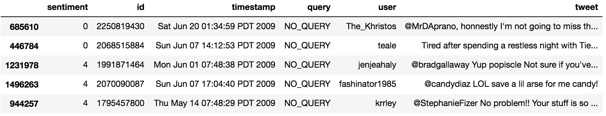
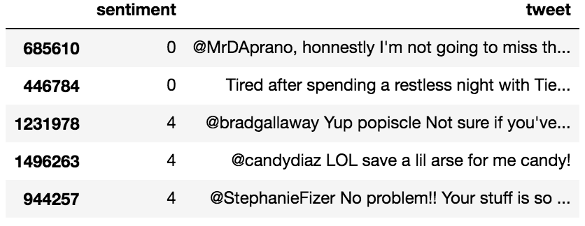
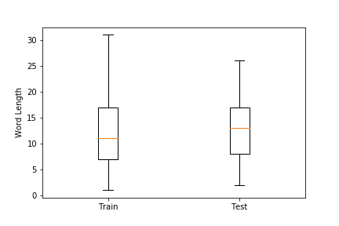
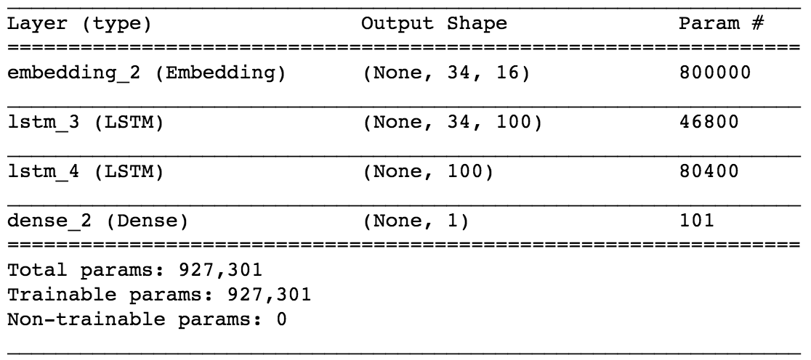
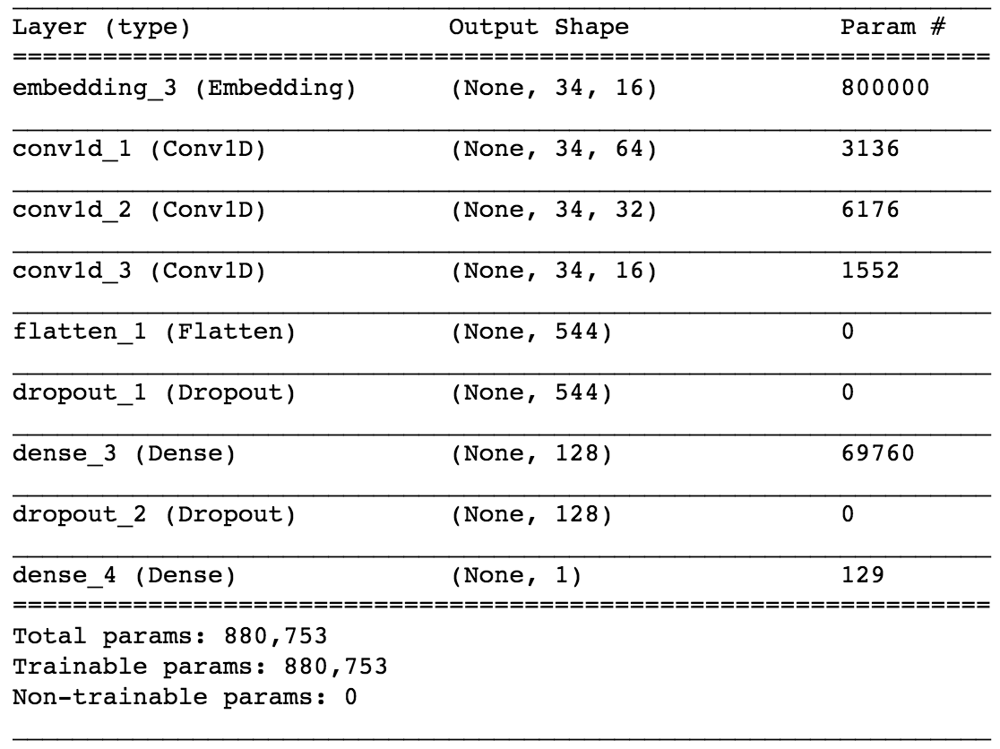
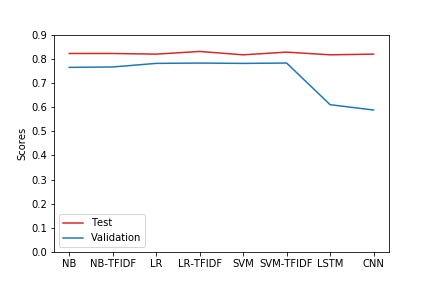

# Sentiment Analysis from Tweets 
### Machine Learning Engineer Nanodegree Capstone Project
Samujjwal Bhandari  
December 11, 2018

## I. Definition

### Project Overview

Twitter ([(https://twitter.com/)](https://twitter.com/)) is a micro-blogging platform that is being used for several purposes such as, expressing beliefs, connecting people, promoting the business, and as such. The messages that we post on Twitter are called tweets. Human sentiments are representative of the current state of an environment defined by a set of events and their occurrences. On change of the state of an environment we tend to perceive the state on our own way and try to express our feelings through different means, where tweets is one of the ways. Such an expression can have different sentiments regarding the situation being perceived for example positive, neutral, and negative to name a few. However, in this project we will be focusing on tweets that can be categorized as contents with positive or negative sentiments. 

Sentiment analysis is a concept that helps predicting an opinion of a user from the context being presented. The context, in general, is represented as a text as an unstructured information. By the application of sentiment analysis on such textual information the opinion about domain such as, products, services, brands, and politics can be derived. Such results of analysis can be used in many applications including marketing analysis, public relations, product reviews, product feedback, and customer service [1]. Past works in semantic analysis has explored various approaches to predict the intention of the text such as, using Naive Bayes, Maximum Entropy, SVM [2], and Recursive Neural Tensor Network [3]. In this project, a collection of tweets taken from [2] with either positive or negative sentiments are used to define the model for predicting sentiments from the newer set of tweets. The tweets were collected with keyword search and the labeling were done based on the emoticons such as :) for the positive sentiment and :( for the negative sentiment. All the emoticons were removed from the data after labelling them.

### Problem Statement

The goal of this project is to classify given text as a positive or negative based on the trained model using the collection of tweets labeled as positive and negative. To accomplish the goal, this project focuses on feature reduction/extraction to improve outcome of learning and the use of machine learning algorithms to develop sentiment classification models. There are several ways to approach the problem such as, neural network defined in [3], Naive Bayes and SVM defined in [2]. Also in conjunction to the learning approaches, feature creation also plays a very crucial role in text analysis. For instance part of speech tagging [2] to explore the text using language semantics can be used during feature extraction. 

The problem in this project is a binary classification of texts. In order to develop a classification model, we use tweets dataset and convert them into feature data considering the concepts such as, unigram/bigram feature vectors, removing noise, and using stemmers to reduce the feature space. Once the feature is extracted we train classification models using Naive Bayes, Support Vector Machine (SVM), Logistic Regression, and Neural Network algorithms. Along with learning the classification models using different algorithms, this project also compares the performance of those algorithms on classifying sentiments from the texts. More specically we use the following tasks to accomplish the project goal.

  1. Feature cleaning and reduction using techniques such as, tokenizing user identifiers and URL from tweets, word stemming, and cleaning repetitive characters appearing more than twice in words as defined in [2], for example, 'hellooooo' will get converted into 'hello'.

  2. Feature vector construction using unigram and bigram models. 

  3. Define and implement train-validate-test pipeline to use Naive Bayes, Logistic Regression, SVM, and Neural Network algorithms.

  4. Tune the parameters and evaluate the performance of each model using the accuracy metrics.

### Metrics

The predictions from classification models are evaluted againsts the classification accuracy measure. Since the dataset for this project has a balanced distribution of positive and negative tweets (~50% for each class after uniform random sampling of training/validation sets), for this binary classification problem accuracy can be a good measure of evaluation. By definition, 

Accuracy = (TP+TN)/total, 

where TP (True Positive) is the number of tweets classified as positive that are actually positive, TN (True Negative) is the number of tweets classified as negative that are actually negative, and total is the number of total tweets used in prediction. We will use the same accuracy measure to compare different models discussed in this proposal against the benchmark model.

## II. Analysis

### Data Exploration and Visualization

</img>

**
Figure 1: Snapshot of Original Dataset
**

Dataset used in this project contains the collection of tweets and corresponding sentiment labeled as 0 for negative and 4 for positive. Figure 1 shows the snapshot of data with the complete structure. In its original form each row is five tuple containing polarity of the sentiment (sentiment), tweet identifier (id), tweet date (timestamp), the query (query) - the value is NO_QUERY if there is no query, the user that tweeted (user), and the actual text of the tweet (tweet). 

</img>

**
Figure 2: Snapshot of Dataset with Unused Columns Removed
**

There are two different datasets. One of the dataset consists of 1.6 million records and is used as a training data. Out of 1.6 million tweets, 800000 tweets are labeled as 0 and the remaining 800000 tweets are labeled as 4. The other dataset consist of total 498 tweets where, 182 of them are labeled as 4, 177 tweets are labeled as 0, and the rest 139 are labeled as 2. The label 2 represents neutral sentiments, however, this project does not deal with the neutral sentiment thus removing the 139 entires from the dataset. The final dataset with 359 tweets with 0 or 4 as labels is used as a test data.

The vocabulary based on the train dataset is has 684358 words. The word counts for each tweets is shown using the box plot in Figure 3. In the training dataset, the range of tweets word length is in the interval [1, 31] and for the test dataset, word length range for the tweets is [2, 26]. 

</img>

**
Figure 3: Boxplot for Word Counts for Tweets in a Training and Testing Datasets
**

We also observed other characterstics from tweets data that will be of use while preprocessing data. These observations are:
- Tweets contain texts that are unstructrued with a lot of typos and informal words that are not part of standard dictionary. Out of different such words some of them have repetitive occurrences of letters such as "loooooooovvvvvveee" which can be cleaned to word "love" giving specific meaning.
- There are a lot of words containing apostrophes that can be expanded to get euivalent meaning. For example, the word "I'm" can be converted to "I am".
- Tweet contains some words that have specific meaning in the context of twitter application. For example, user name - @stellargirl - is a word starting with @ symbol and hash tag -  #kindle2 - is a word starting with # symbol.
- Tweet contains URLs and encoded html characters such as &amp;lt;

### Algorithms and Techniques

#### Stemming

Stemming is the process that generally removes the end of words in order to obtain the base word called stem that can possibly have the similar semantics. For example, "retrieved" and "retrieves" reduce to the stem "retrieve". In this work, we uses stemming for reducing the size of the vocabulary that reduces the dimension of the feature vector used to learning. In particular, we use the algorithm called Porter's algorithm [5], which is the most common algorithm shown to be practically effective for stemming English.

#### Tokenization

Tokenization is the process of splitting text into multiple meaningful words called token. We use tokenization for vectorizing the data (discussed later) and doing the integer encoding of tokens as the input for machine learning algorithms.

#### Vectorization

Text vectorization converts the text into a vector suitable for aplying machine learning algorithm. There are several ways to do vectorization. However, irrespective of the approach, in general, the size of the vector is defined by the size of the vocabulary obtained from the set of texts used in the process. Each position of the vector represents a unique word in the text. In this work, we use the Bag of Words and Term Frequency-Inverse Document Frequency (TF-IDF) approaches discussed below.

##### Bag of Words

The vector generated from bag of word approach contains the frequency of the word in each position from text being converted. The final output is the table of such vectors where each row represents the text from the set of texts. 

##### Term Frequency-Inverse Document Frequency (TF-IDF)

TF-IDF approach uses a weight, instead of just a word frequency, that evaluates importance of a word to a text in a collection of texts. The importance of a word increases as the word frequency increases on the text, however if the same word appear in many texts then importance is offset as it may be too common to distinguish text. The computation of TF-IDF weight is a two step process where normalized TF and IDF are computed as below:

TF(word) = (Frequency of a term 'word' in a text) / (Total number of terms in the text).

IDF(word) = ln(Total number of texts / Number of texts with term 'word' in it).

Finally, TF-IDF(word) = TF(word) * IDF(word)

#### Word Embedding

A word embedding is used to represent words and documents with a dense vector. Unlike large sparse vectors from bag of word models, in an embedding, a vector is defined by the projection of the word in to continuous vector space. In this process, the position of a word in vector space is learned from the words surrounding it in texts. This position of the word is called embedding. In this work, we use word embedding as a layer to produce input for learning deep neural network. Word2Vec ([https://code.google.com/archive/p/word2vec/](https://code.google.com/archive/p/word2vec/)) and GloVe ([https://nlp.stanford.edu/projects/glove/](https://nlp.stanford.edu/projects/glove/)) are the most common models to convert text to vectors.

#### Naive Bayes

Naive Bayes is a popular algorithm for text classification. For instance see discusion in [7]. Naive Bayes runs fast compared to other supervised learning models, and it doesn't need high amounts of data to work properly. However, it gives best performance when there is a weak correlation between the underlying features. In this project, we experiment with Naive Bayes to evaluate the perfromance of sentiment classifcation. This algorithm is based on the Bayes' Theorem defined with the assumption that all the feature variables are independent of each other. The following formula defines Bayes' Theorem.

P(C|X)  = P(X|C) * P(C) / P(X), where C represents class, X represents data as a feature vector, P(X) is the predictors prior probability,  P(C) is a prior probability of the class distribution, P(X|C) is likelihood of data, and P(C|X) is a posterior probability that describes the class being true given the features.

#### Logistic Regression

Logistic regression is one of the well understood classification algorithms that uses logistic function defined as h(y)= 1/ (1 + e^-y). Being a simple model it is also a very powerful learning algortithm that have been shown to be applicable in different domains. In this project, we will use a logistic regression model to get the classification accuracy. In logistic regression, the output is in the form of probabilities of the class generated by applying the logistic function. A threshold is then applied to force this probability into a binary classification. The y value in the above formula is a linear combinatin of feature vector X with the weight vector W, where X and actual class is used to find the values of W that minimize the error between the predicted outcome and the actual outcome. These weights are estimated using the technique of Maximum Likelihood Estimation.

#### Support Vector Machines (SVM)

A Support Vector Machine (SVM) is a classifier defined by a separating hyperplane. Given a labeled training data, the algorithm outputs an optimal hyperplane. In N dimentional space this hyperplane is a N-1 dimensional plane that divides N-space in two parts where each class belongs to either side. There is a well defined theory concerning margins that backs up SVM, and which gives a reliable guarantee regarding overfitting. However, SVM is memory intensive and can be very inefficient for large data sets. Another issue with SVM is tuning of many parameters such as kernel, gamma, and regularization parameters. Since this project has relatively large number of samples, we use linear kernel for efficiently learning the model.

#### Long-Short Term Memory (LSTM) Network

Each word in a sentence depends greatly on what came before and comes after it. In order to account for such dependencies, Recurrent Neural Network (RNN) and its variant like Long-Short Term Memory have proved to be quite good. LSTM networks [8] are capable of learning order dependence in sequence prediction problems. The LSTM architecture was motivated by an analysis of error flow in existing RNNs where long time lags were inaccessible to existing architectures, because backpropagated error either blows up or decays exponentially. Due to the ability to handle positional dependencies, this project will evaluate the performance of LSTM for sentiment predictions from tweets.

#### Convolutional Neural Network (CNN)

A CNN contains one or more convolutional layers, pooling layers, and/or fully connected layers, and uses a variation of multilayer perceptrons. Convolutional layers use a convolution operation to the input passing the result to the next layer. This operation allows the network to be deeper with much fewer parameters. Work in [9], demonstrate that CNNs can achieve outstanding performance without the knowledge of words, phrases, sentences and any other syntactic or semantic structures with regards to a human language. Refering to this past work, this project will evaluate CNN for sentiment analysis problem.

### Benchmark

We used the polarity lexicon from [4] for classifying the tweets based on the occurrences of the words from the lexicon in the tweets. Each tweet is analyzed for the occurrences of the words from polarity lexicon. If we have equal number of occurrences of both positive and negative words we will consider the tweet to be positive. Otherwise, if there is more number of negative/positive words the tweet is classified to have negative/positive sentiment.

Applying the discussed technique in our training and testing data, we found classification accuracy of baseline model for 1) training data to be 0.552273 and 2) testing data to be 0.604457.

## III. Methodology

### Data Preprocessing

To implement learning algorithms, we performed several data preprocessing tasks based on the tweet dataset. We also implemented different algorithms for generating classifier models. In this section we discuss each preprocessing methods and their usage on our classfier model generation process. To implement data preprocessing task we have used several libararies such as, scikit-learn [10], nltk [11], and Keras [12].

#### Data Cleaning and Tokenization

Based on the findings from the data exploration and the nature of the problem we performed series of data cleaning and transformation steps as a cleaning method as discussed below.

  1. URL, Hashtag, and User name tokenization: URLs, hashtags (word starting with #), and user name (word starting with @) are very common in tweets dataset. Since they represent an object with common semantics we extracted each of the URL, hashtag, and user name and replaced them with keywords URL, HASHTAG, and USER respectively to reduce vocabulary size.

  2. Repetitive character removal: Some of the words in tweets such as, hellooooo and looooovely are not standard words. However, they carry meanings if hellooooo is changed to hello and looooovely is changed to lovely. To handle words with repetitive characters, in this step, we replaced all the characters appearing more than two times consecutively, to a single character so that we could normalize the word as close as possible.

  3. Cleaning word with apostrophes: This step also is used to normalize words. Some of the words such as don't and I'm can be written as 'do not' and 'I am' respectively. This way we can get normal representation of word for the ones with apostrophes. Most of the translation of such kind of words has been used from [https://www.grammar-monster.com/lessons/apostrophes_replace_letters.htm](https://www.grammar-monster.com/lessons/apostrophes_replace_letters.htm).

  4. Removal of stop words: In a given text there are a lot of words that are very common to the language being used to write the tweet. It is very common practice to remove such word in natural language processing domain just to keep the words that are more meaningful and important to define the semantics of the text. Also, this help us greatly reduce the feature vector size helping the feature extraction task. This work used **stopwords** from nltk library to filter stop words from the tweets.

  5. Word stemming: In order to further reduce the size of the feature vector we used **PorterStemmer** from nltk library for stemming.

#### Vectorization

To extract features to pass as input to the learning algorithms namely - Naive Bayes', Logistic Regression, and SVM - we used the data cleaning approach discussed above with two falvors of vectorizations 1) Count Vectorization and 2) TF-IDF Vectorization. While any one of the vectorization would have worked for learning the model, for the purpose of evaluating results based on the vectorization technique used we used both the approaches in this work. The count vectorization used the class called **CountVectorizer** and TF-IDF vectorization used the class **TfidfVectorizer** from scikit-learn libaray. Similarly, in order to feed integer encoded input to the embedding layers of neural networks implemented in this work we used **Tokenizer** class from Keras library.

### Implementation

Implementation of learning algorithms used scikit-learn [10] and Keras [12] libraries. For each vectorizer, we generated both unigram and bigram feature vectors. Before generating the feature vector the custom preprocessing method desribed in previous section was used. Given the preprocessing output, we implemented eight different algorithms as discussed below. 

  1. Naive Bayes' with Count Vectorizer: The multinomial naive bayes **MultinomialNB** from scikit-learn was used with default parameters along with **CountVectorizer** for feature extraction. 

  2. Naive Bayes' with TF-IDF Vectorizer: **MultinomialNB** with default parameters and **TfidfVectorizer** extracted features were used for this implementation. 

  3. Logistic Regression with Count Vectorizer: **LogisticRegression** from scikit-learn library with default parameters for C = 1.0 along with features generated from **CountVectorizer** were used in this implementation.

  4. Logistic Regression with TF-IDF Vectorizer: **LogisticRegression** with default parameters for C = 1.0 and features resulted from **TfidfVectorizer** were used for this implementation.

  5. Linear SVM with Count Vectorizer: **LinearSVC** from scikit-learn library with default parameters for C = 1.0 and **CountVectorizer** for feature extraction were used in this implementation.

  6. Linear SVM with TF-IDF Vectorizer: **LinearSVC** with default parameter for C = 1.0 and  **TfidfVectorizer** for feature extraction were used for this implementation.

  7. LSTM with Word Embedding: Using Keras libray we implemented LSTM network as shown in Figure 4. **Tokenizer** from Keras library was used to generate integer sequence of preprocessed tweets as a feature vector to be passed as an input to the network.

</img>

**
Figure 4: Summary of LSTM Network Architecture Used in Implemenation
**

  8. CNN with Word Embedding: Using Keras libray we implemented CNN network as shown in Figure 5. **Tokenizer**  was used  with custom preprocessor to generate feature vector as an input to the network.

</img>

**
Figure 5: Summary of CNN Network Architecture Used in Implemenation
**

### Refinement

To search for the better performing models in each category of implementations discussed in previous section, this work used **GridSearchCV** from scikit-learn library for parameter tuning and getting the best models from each category. The following setup were used to tune the parmeters.

  1. Each run was perfomed to do 3-fold cross validation in order to cope with possible overfitting. The choice of the 3-fold cross-validation was mainly for reducing learning time.

  2. Models were trained using unigram and bigram models, i.e., ngram_range = (1, 1) and ngram_range = (1, 2) options for all **TfidfVectorizer** and **CountVectorizer** uses.

  3. C = (0.001, 0.01, 0.1, 1.0, 10) were used to run **LogisticRegression** and **LinearSVC** algorithms.

  4. batch_size = 1000, epochs = [1, 2], and embedding_size = [8, 16] were used to run both LSTM and CNN networks.

  5. lstm_cell = [50, 100] were used while running LSTM network.

  6. dropout_rate=[0.3, 0.6] were used while running CNN network.

  7. Since CNN and LSTM models were created using Keras library, **KerasClassifier** from Keras library was used to create a model for use in **GridSearchCV**.

  8. For models other than neural networks pipelines with [vectorizer, learning model] sequence were run using the parameters discussed in this section.

With grid search for parameter tuning we were able to choose the best models from each category for model comparison discussed in later section. For repetability and using the models for predicting the test data, we analyzed the result of grid search and rerun the gridsearch with reduced parameter range for faster learning as well as validating the results from previous run. The results discussed in this report are based on the final grid search run. However, codes for both grid search run are provided in supplemental materials.

## IV. Results

### Model Evaluation and Validation

The implementation of learning models were used to evaluate the performance of several models already discussed in this report. For evaluation, this project ran the following pipelines to generate the best models defining parameters described below using the grid search.

  1. Naive Bayes (Count Vectorizer): [CountVectorizer, MultinomialNB] with bigram features

  2. Naive Bayes (TF-IDF Vectorizer): [TfidfVectorizer, MultinomialNB] with bigram features

  3. Logistic Regression (Count Vectorizer): [CountVectorizer, LogisticRegression] with bigram features and C = 0.1

  4. Logistic Regression (TF-IDF Vectorizer): [TfidfVectorizer, LogisticRegression] with bigram features and C = 1.0

  5. SVM (Count Vectorizer): [CountVectorizer, LinearSVC] with bigram features and C = 0.01

  6. SVM (TF-IDF Vectorizer): [TfidfVectorizer, LinearSVC] with bigram features and C = 0.1

  7. LSTM: [LSTM Model] (See Figure 4 for architecture) with word embedding size = 16, batch size = 1000, #LTSM cell = 100, and epochs = 2

  8. CNN: [CNN Model] (See Figure 5 for architecture) with word embedding size = 16, batch size = 1000, dropout rate = 0.6, and epochs = 2

From above list we can see that all the alogorithms performed well for bigram features when compared to the unigram feature models. This is very intuitive result that we could validate from the models.

The table below shows the accuracy score for each model we picked from grid search. From the table we can notice that the validation score for all non-neural network based algorithms are very similar in the range of ~ 76% - 78% accuracy and all of them are viable solution for sentiment analysis application. But, the network based approaches have low validation scores ~ 58% and 61% and we exclude them from the viable solutions with current state of the model performance.  Out of all the models Logistic Regression with TF-IDF vectorizer and SVM with TF-IDF Vectorizer performed the best with ~78.2% of validation accuracy.

  <table>
  <tr>
    <th>Model</th>
    <th>Validation Accuracy</th>
    <th>Test Accuracy</th>
  </tr>

  <tr><td>Naive Bayes (Count Vectorizer)</td><td>0.764217</td><td>0.821727</td></tr>
<tr><td>Naive Bayes (TF-IDF Vectorizer)</td><td>0.765830</td><td>0.821727</td></tr>
<tr><td>Logistic Regression (Count Vectorizer)</td><td>0.780695</td><td>0.818942</td></tr>
<tr><td>Logistic Regression (TF-IDF Vectorizer)</td><td>0.782027</td><td>0.830084</td></tr>
<tr><td>SVM (Count Vectorizer)</td><td>0.780621</td><td>0.816156</td></tr>
<tr><td>SVM (TF-IDF Vectorizer)</td><td>0.782117</td><td>0.827298</td></tr>
<tr><td>LSTM</td><td>0.609803</td><td>0.816156</td></tr>
<tr><td>CNN</td><td>0.587616</td><td>0.818942</td></tr>
  </table>

**
Table 1: Model Performances
**

To further validate the performance of models and see if the models generalize well or not, we used test data discussed above in **Analysis** section and measured test accuracy of each model. For all the models the test accuracy outperformed the validation accuracy as seen from Table 1 with the best performance for Logistic Regression with TF-IDF Vectorizer. 

### Justification

Based on the baseline model the accuracy score of 0.552273 (train) is less than all the validation scores and 0.604457 (test) is less than  all the  test score of all the models under discussion. Among the stated viable solutions (see previous section discussion), the minimun validation score is 0.764217 for Naive Bayes' with Count Vectorizer and the minimum test score is 0.816156 for SVM with Count Vectorizer. Notice that both the scores are well above the baseline scores.

By looking at the performance of the models, Logistic Regression with TF-IDF Vectorizer and  SVM with TF-IDF Vectorizer seems the best. Moreover, SVM and Logistic Regression irrespective of the vectorizer are peforming well and are comparable in performance. 

## V. Conclusion

### Free-Form Visualization
Consider the result from Table 1 and observe the plot shown in Figure 6 using the data from Table 1. We found that for all the models discussed in this project, test accuracy scores are consistently around similar range ~ 82% - 83%. This observation is interesting as it seems that for the problem of sentiment analysis all the models are suitable. However if we consider the validation score, for two models LSTM and CNN, they are very low compared to other models even though, the test scores are very good.

</img>

**
FIgure 6: Validation and Test Accuracy Scores
**

Wide range of the validation scores and the test scores for LSTM and CNN models is an interesting result that needs investigation. This work did not dig into the reason for such discrepency in validation and test scores for LSTM and CNN model and is the subject of further study.

### Reflection
To accomplish the goal of this project, we focused in two step process namely data preprocessing and learning the models. For data preprocessing we had to analyze dataset to identify the characterstics of data before cleaning and transforming data to suitable form for learning. This step was one of the most difficult phases of the project as not only the data statistics but also the knowledge about the language, vocabulary, and grammar being used in data was needed. 

The learning phase was also very interesting. One of the difficulty we faced during learning models was the chosing learning alogrithms and preprocessing tasks to use. After the algorithms selection, the use of **GridSearchCV** from scikit-learn library reduced the complexity of parameter tuning process. However, tuning the parameters was a very time consuming process. By running different algorithms and preprocessing tasks, we found that most of the algorithms learned the dataset pretty well. With this kind of results chosing a particular model became very hard. That is why we identified Logistic Regression and SVM as a model to use. 

We also faced lots of time/memory problems while running the learning algorithms on training data with cross-validation. Since our training dataset is relatively big with 1.6 million records, running each algorithm mutliple times using different set of parameters and execution pipelines were very time consuming. Of course, this should not be the issue for functionality of the project. However, we learned the need of better pipeline design and execution strategy before running and implementing the project to save time.

### Improvement
For most of the algorithms implemented in this project, the performance scores were well above the baseline. However, there are several possibilites for improving the performance of the models. Some of the improvements we think of are:

  1. Use of the lemmatization instead of stemming. Though, both the approaches normalizes the word, lemmatization can normalize structurally different words into a single word based on the semantics. We think, this will reduce the feature size by converting semantically similar words into one and improve the overall prediction performance.

  2. Use dimensionality reduction appraoch such as Principle Component Analysis (PCA) so that only important and distinguising word features are used for learning the model. We think this would help model become simpler and can generate models that generalizes as possibly the collected reduced features set used for learning can be more informative in unseen data.

  3. We beleive LSTM and CNN can perform better than the results we got in this work. To validate so, we should experiment with different network architectures of varying layers and depths.

  4. Finally, we think there is an architecture for LSTM and CNN which with the application of improvements 1 and 2 discussed above can beat the current best results obtained from Logistic Regression and/or SVM.

### Reference

[1] [https://monkeylearn.com/sentiment-analysis/#sentiment-analysis-use-cases-and-applications](https://monkeylearn.com/sentiment-analysis/#sentiment-analysis-use-cases-and-applications)

[2] Go, A. (2009). Sentiment Classification using Distant Supervision.

[3] Socher, R., Perelygin, A., Wu, J., Chuang, J., Manning, C.D., Ng, A.Y., & Potts, C. (2013). Recursive Deep Models for Semantic Compositionality Over a Sentiment Treebank. EMNLP.

[4] [https://github.com/felipebravom/StaticTwitterSent/blob/master/extra/polarity-lexicon.txt](https://github.com/felipebravom/StaticTwitterSent/blob/master/extra/polarity-lexicon.txt)

[5] Porter, Martin F. (1980). An algorithm for suffix stripping. Program 14 (3): 130-137.

[6] Salton G. and Buckley C. (1988). "Term-weighting approaches in automatic text retrieval". Information Processing & Management, 24 (5).

[7] [https://nlp.stanford.edu/IR-book/html/htmledition/naive-bayes-text-classification-1.html](https://nlp.stanford.edu/IR-book/html/htmledition/naive-bayes-text-classification-1.html)

[8] [https://machinelearningmastery.com/gentle-introduction-long-short-term-memory-networks-experts/](https://machinelearningmastery.com/gentle-introduction-long-short-term-memory-networks-experts/)

[9] Xiang Zhang, Yann LeCun (2015). Text Understanding from Scratch

[10] [https://scikit-learn.org/stable/index.html](https://scikit-learn.org/stable/index.html)

[11] [https://www.nltk.org/](https://www.nltk.org/)

[12] [https://keras.io/](https://keras.io/)
